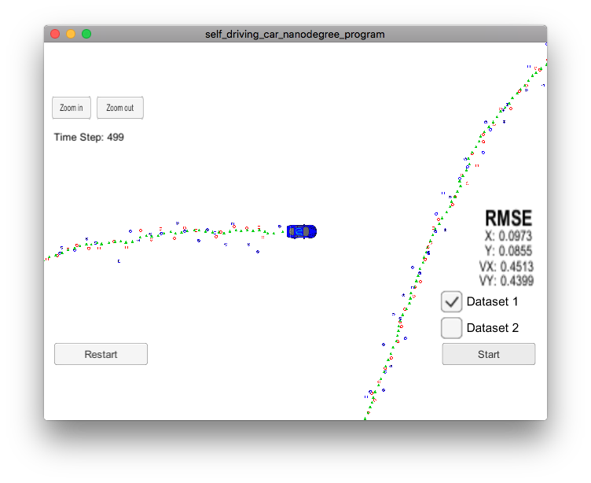
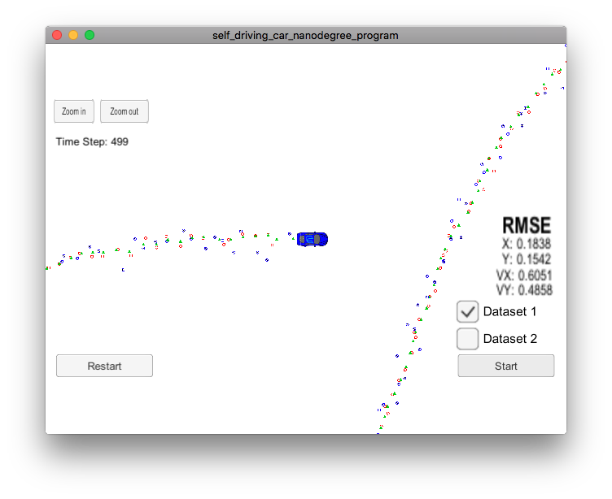
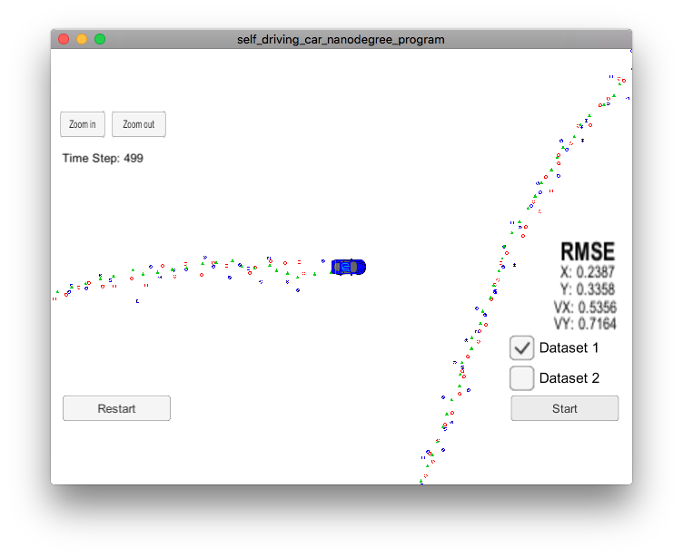

# Extended Kalman Filter Project Starter Code
Self-Driving Car Engineer Nanodegree Program

In this project an Extended Kalman Filter was implemented in C++.

## Implementation

This phase was quite straight forward, a lot of material was provided
during the lessons and the only difficult part was the initialization of
the covariance matrix P. As others pointed out 1 for x and y position
and 1000 for velocity x and velocity y seem to provide the best results.
Bigger values like 10000 or smaller like 0 do not work as well.

In general I have tryed to reuse code and avoid computing the same
values multiple times, when not needed.

## Results

Below there are three screenshots of the results from the simulator.

### LIDAR and RADAR

### LIDAR only

### RADAR only

The LIDAR seems to be doing a better job for determining position, while
for the velocity metric, it does not appear a winner.

Both sensors together provide the best results.